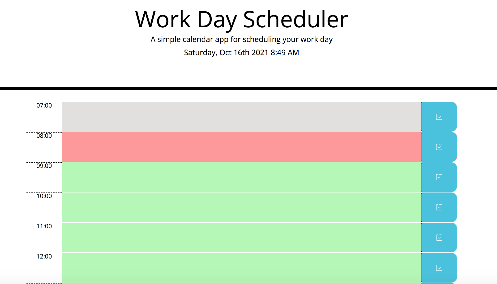

# WorkDayScheduler

This is a simple calendar application that allows the user to save tasks for each hour of the day and stores it into the local storage. As the day progresses the hours in the past will show up in grey, the current hour will change to red, and the past hour will turn to green.
 
## Acceptance Criteria
```
GIVEN I am using a daily planner to create a schedule

WHEN I open the planner
THEN the current day is displayed at the top of the calendar

WHEN I scroll down
THEN I am presented with timeblocks for standard business hours

WHEN I view the timeblocks for that day
THEN each timeblock is color coded to indicate whether it is in the past, present, or future

WHEN I click into a timeblock
THEN I can enter an event

WHEN I click the save button for that timeblock
THEN the text for that event is saved in local storage

WHEN I refresh the page
THEN the saved events persist
```

## Link to Deployed Application

https://parisa-ostovari.github.io/WorkDayScheduler/

## Link to GitHub Repository

https://github.com/parisa-ostovari/WorkDayScheduler

## Screenshot
Here is the snapshot of how the website should look like:
 
 When first opened:

